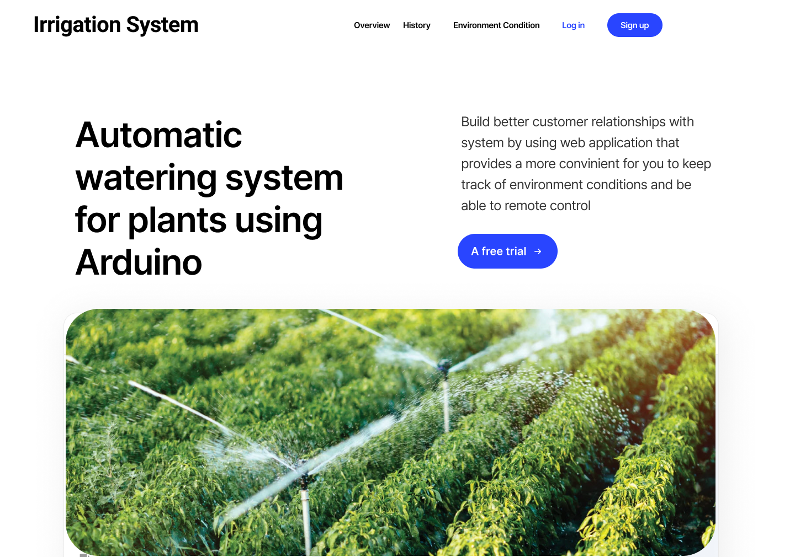

<!-- icons  -->
[1.1]: https://img.shields.io/badge/GitHub-100000?style=for-the-badge&logo=github&logoColor=white
[2.1]: https://img.shields.io/badge/LinkedIn-0077B5?style=for-the-badge&logo=linkedin&logoColor=white
[3.1]: https://img.shields.io/badge/Medium-12100E?style=for-the-badge&logo=medium&logoColor=white
[4.1]: https://img.shields.io/badge/Twitter-1DA1F2?style=for-the-badge&logo=twitter&logoColor=white

<!-- links to your social media accounts -->
[1]: https://github.com/produdez
[2]: https://www.linkedin.com/in/produdez/
[3]: https://medium.com/@produde
[4]: https://twitter.com/_Produde_

# Smart Irrigation System

"Best of rain"

<p align="center">
    
</p>

**Description:**

Plant monitoring and watering system. A web-app backed by IOT through MQTT interface. (BACKEND)



This repo is the back-end of this project. Frontend is [Here](https://github.com/produdez/iot_project)

Project's report can be found [Here](https://www.overleaf.com/read/wbcgwwwmqryj)

## Why backend?

- Cause there must be a background progress to keep updates from adafruit when client is not logged in!
- Also, since is's almost impossible to get past data from ada feed, we can use our server to push data into firebase and then later client can take that data and plot history!.
- It's just impossible to make notification make sense when you do not have a server!

## Technologies Used

- Firebase Database
- MQTT
- Node
- AdaFruit Interface

## Features

See more at [Frontend](https://github.com/produdez/iot_project)

## Setup

Requirements and Installations:

1. git, node
2. Clone repository
3. Install dependencies

    ```[bash]
    # Install dependencies
    $ npm install
    ```

## Usage

- Just npm start
- Wait (just a bit) until console shows:

``` bash
> server@0.0.0 start
> node ./bin/www
```

- Go to http://localhost:8081/ if need to see web page 
- For server, we work mostly with console actually
- All the setup and ada/firebase listen is loged to console so read console for more detail!

Update 31/5

- Set the global.UPLOAD_FAKE_DATA_TO_ADA to true to send fake data 

## Current progress

Currently, the server will

- After a while (every 10 seconds), server will push a random value to adafruit's moisture sensor
- Listen for moisture from adafruit
- When moisture change, call notificationService to push notification
- notificationService will check plantSettings (threshold) before deciding to push noti or not
- The school's provided ada account is in the .env file
- But the access key for adaServer is GET from a link (in GetJSON.js)

Update 31/5

- Choose to send fake data to adafruit by setting global.UPLOAD_FAKE_DATA_TO_ADA to true
- All needed envCond conditions are checked when adafruit feed updates
- temp-humi is split into two and notification is sent separatedly
- plant settings is pulled from firebase 
- Adafruit server connection is establish in adaService.js and the mqttclient is set global so other services can use. (the .on function is set is each specific service, the topic has to be checked before running code!)
- Loging is update to help clearer view, the plant's setting can be logged in plantSettingService.js line (25,26,27,28) but i comment it out since the setting is long and messy in logging!

## TODO

- Record history in the envCond Services

## Contact

Created by [@produdez](https://github.com/produdez) - feel free to contact me or follow my blog on medium ❤️!

<!-- [![alt text][1.1]][1] -->
[![alt text][2.1]][2]
[![alt text][3.1]][3]
[![alt text][4.1]][4]
